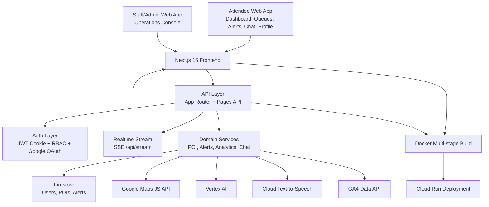
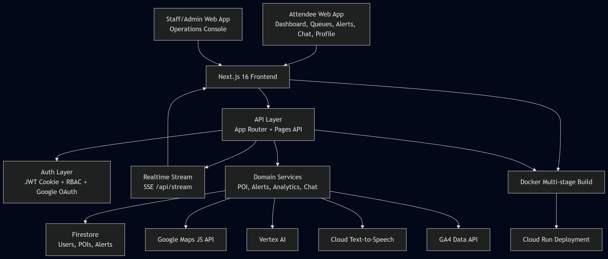

# Stadium Sync

Production-grade physical event experience platform for high-capacity sporting venues.

Stadium Sync helps attendees move faster, wait less, and stay informed, while giving operations teams a secure control surface for live coordination.

## Problem Statement

Design a solution that improves the physical event experience for attendees at large-scale sporting venues. The system should address challenges such as crowd movement, waiting times, and real-time coordination, while ensuring a seamless and enjoyable experience.

At peak event load, venues need to solve three things at once:

1. Help attendees navigate quickly in a complex physical space.
2. Reduce time lost in unpredictable queues.
3. Coordinate operations teams in real time when conditions shift.

## Why Existing Solutions Fail

Most venue experiences still rely on fragmented systems:

1. Static signage cannot adapt to live crowd pressure.
2. Queue information is delayed, siloed, or unavailable to attendees.
3. Staff tools and attendee tools are disconnected, which slows response.
4. Incident communications are often manual and inconsistent.
5. Operational intelligence is reactive, not predictive.

The result is avoidable congestion, fan frustration, and slower operations decisions.

## Our Solution

Stadium Sync unifies attendee guidance and operations intelligence in one mobile-first web platform.

The platform combines:

1. Live stadium mapping and route assistance.
2. Real-time queue telemetry with streaming updates.
3. Staff/admin operations controls for queue simulation and interventions.
4. Stadium-wide alert publishing.
5. Google Cloud AI workflows for insights and communication.
6. Security-by-default authentication and role-based access control.

This creates a shared operational picture across attendees, staff, and administrators.

## Key Features

### Attendee Experience

1. Live dashboard with interactive stadium map.
2. Search + smart filters for concessions, restrooms, exits, merch, and first aid.
3. Seat/block routing with nearest-gate guidance.
4. Nearest-exit routing with fallback logic.
5. Live queue visibility and pressure indicators.
6. Alerts feed with active and historical advisories.
7. AI chat concierge for routing, queues, amenities, and safety guidance.
8. Profile experience with authenticated account context.

### Staff and Admin Operations

1. Protected operations console at /admin for STAFF and ADMIN roles.
2. One-click POI data seeding for controlled environment setup.
3. Rush-event simulation to stress and validate operational response.
4. Alert creation with severity and audience controls.
5. Google Cloud Text-to-Speech generation for announcement audio.
6. Vertex AI queue analysis with hotspot and recommendation outputs.
7. Safe fallback insights and chat responses when cloud AI is unavailable.

### Platform Engineering and UX

1. Next.js 16 App Router architecture with TypeScript.
2. Firestore-backed repositories for POIs, users, and alerts.
3. Real-time queue updates over SSE via /api/stream.
4. Redux Toolkit + TanStack Query for robust client state and caching.
5. Responsive shell and reusable UI primitives for rapid feature delivery.
6. PWA support with manifest and service worker integration.
7. Role-aware navigation and route-level access behavior.

## Google Services Used

| Google Service                  | Usage in Stadium Sync                                           |
| ------------------------------- | --------------------------------------------------------------- |
| Google Maps JavaScript API      | Live stadium map rendering, marker overlays, routing visuals    |
| Google OAuth 2.0                | User authentication via Google sign-in                          |
| Google Cloud Firestore          | Managed primary data store for users, POIs, alerts, queue state |
| Google Cloud Text-to-Speech     | Admin-generated spoken announcements for venue operations       |
| Google Vertex AI                | Queue hotspot analysis, recommendations, and chat responses     |
| Google Analytics Data API (GA4) | Operations analytics endpoint for overview metrics              |
| google-auth-library             | Server-side access token management for Google APIs             |
| Google Cloud Run                | Target runtime for scalable containerized production deployment |

## Architecture Diagram





## Scalability & Security

### Scalability

1. Stateless JWT session model supports horizontal scaling.
2. Firestore provides managed scaling for high-read operational workloads.
3. SSE event stream sends lightweight queue patches instead of full payload churn.
4. TanStack Query caching reduces redundant network load.
5. Next.js standalone build plus Docker multi-stage image supports efficient deploys.
6. Cloud Run-ready architecture enables burst handling for event-day traffic.

### Security

1. HttpOnly auth cookies with SameSite and Secure-in-production behavior.
2. JWT signing and verification with strict role claim validation.
3. Role-based access control for staff/admin-only operations.
4. Password hashing with bcrypt (cost factor 12).
5. Zod validation on auth and admin API payloads.
6. OAuth next-route sanitization and controlled callback behavior.
7. Server-only Google API access patterns through authenticated endpoints.

### Reliability, Testing, and Production Readiness

1. Jest-based unit and API route tests with coverage reporting for fast feedback in CI.
2. End-to-end Playwright suite across Chromium, Firefox, and WebKit.
3. E2E coverage for auth, dashboard, queues, alerts, profile, and admin workflows.
4. Deterministic network mocking for maps, stream, and cloud endpoint behavior.
5. Retry, trace, screenshot, and video capture for dependable CI diagnostics.
6. Defensive API and UI fallback states for degraded external dependencies.
7. PWA readiness for mobile-first venue usage patterns.
8. Accessibility hardening validated with axe-core scans across core routes and Lighthouse accessibility score of 100 on key routes.

## Product Routes

| Route                               | Purpose                                  | Access            |
| ----------------------------------- | ---------------------------------------- | ----------------- |
| /                                   | Product overview and CTAs                | Public            |
| /dashboard                          | Live map, queue overlays, route guidance | Public            |
| /queues                             | Queue analytics and priority table       | Public            |
| /alerts                             | Active and historical stadium advisories | Public            |
| /chat                               | AI concierge for venue guidance          | Authenticated     |
| /profile                            | User identity and quick actions          | Public/Auth-aware |
| /admin                              | Operations console                       | Staff/Admin       |
| /login, /register, /forgot-password | Auth lifecycle                           | Public            |

## API Snapshot

| Endpoint                  | Method | Purpose                                    | Access        |
| ------------------------- | ------ | ------------------------------------------ | ------------- |
| /api/auth/register        | POST   | Register user and issue session cookie     | Public        |
| /api/auth/login           | POST   | Authenticate user and issue session cookie | Public        |
| /api/auth/logout          | POST   | Clear session cookie                       | Authenticated |
| /api/auth/session         | GET    | Resolve session state and user role        | Public        |
| /api/auth/google          | GET    | Start Google OAuth flow                    | Public        |
| /api/auth/google/callback | GET    | Complete OAuth and create session          | Public        |
| /api/pois                 | GET    | List POIs and queue data                   | Public        |
| /api/poi/:id              | GET    | Get single POI                             | Public        |
| /api/stream               | GET    | Real-time queue patch stream (SSE)         | Public        |
| /api/seed                 | GET    | Seed POI dataset                           | Staff/Admin   |
| /api/trigger-rush         | GET    | Simulate queue pressure spike              | Staff/Admin   |
| /api/alerts               | GET    | Read alerts feed                           | Public        |
| /api/alerts               | POST   | Create alert                               | Staff/Admin   |
| /api/alerts/:id           | GET    | Read one alert                             | Public        |
| /api/alerts/:id           | PATCH  | Update alert                               | Staff/Admin   |
| /api/alerts/:id           | DELETE | Delete alert                               | Staff/Admin   |
| /api/analytics/overview   | GET    | Read GA4 overview metrics                  | Staff/Admin   |
| /api/tts                  | POST   | Generate TTS announcement audio            | Staff/Admin   |
| /api/vertex/wait-times    | POST   | Generate queue insights                    | Staff/Admin   |
| /api/chat                 | POST   | Generate AI concierge response             | Authenticated |

## Tech Stack

| Layer        | Technology                                                           |
| ------------ | -------------------------------------------------------------------- |
| Frontend     | Next.js 16, React 19, TypeScript                                     |
| UI           | Tailwind CSS v4, shadcn/ui, Radix primitives                         |
| State & Data | Redux Toolkit, TanStack Query                                        |
| Realtime     | Server-Sent Events (SSE)                                             |
| Data Layer   | Google Cloud Firestore                                               |
| Auth         | JWT (jose), Google OAuth (passport-google-oauth20), HttpOnly cookies |
| Validation   | Zod                                                                  |
| AI           | Google Vertex AI                                                     |
| Voice        | Google Cloud Text-to-Speech                                          |
| Analytics    | Google Analytics Data API                                            |
| Deployment   | Docker, Google Cloud Run (target)                                    |

## Getting Started

### Prerequisites

1. Node.js 20+
2. npm 10+
3. Google Cloud project with Firestore enabled

### Install

```bash
npm install
```

### Configure Environment

macOS/Linux:

```bash
cp .env.example .env.local
```

Windows PowerShell:

```powershell
Copy-Item .env.example .env
```

### Run Locally

```bash
npm run dev
```

Open http://localhost:3000.

## Environment Variables

| Variable                        | Required | Purpose                                |
| ------------------------------- | -------- | -------------------------------------- |
| NEXT_PUBLIC_GOOGLE_MAPS_API_KEY | Yes      | Client-side stadium map rendering      |
| AUTH_JWT_SECRET                 | Yes      | JWT signing secret                     |
| AUTH_COOKIE_NAME                | Optional | Session cookie override                |
| GOOGLE_OAUTH_CLIENT_ID          | Yes      | Google OAuth client ID                 |
| GOOGLE_OAUTH_CLIENT_SECRET      | Yes      | Google OAuth client secret             |
| GOOGLE_OAUTH_CALLBACK_URL       | Yes      | OAuth callback URL                     |
| GOOGLE_ANALYTICS_PROPERTY_ID    | Yes      | GA4 property ID for analytics endpoint |
| GOOGLE_CLOUD_PROJECT_ID         | Yes      | Google Cloud project context           |
| FIRESTORE_PROJECT_ID            | Optional | Firestore project override             |
| FIRESTORE_DATABASE_ID           | Optional | Firestore database override            |
| GOOGLE_CLOUD_LOCATION           | Yes      | Vertex region                          |
| GOOGLE_VERTEX_MODEL             | Yes      | Vertex model name                      |
| GOOGLE_TTS_LANGUAGE_CODE        | Yes      | Default TTS language                   |
| GOOGLE_TTS_VOICE_NAME           | Yes      | Default TTS voice                      |
| GOOGLE_APPLICATION_CREDENTIALS  | Optional | Local ADC credential file path         |

## Available Scripts

1. npm run dev: Start development server.
2. npm run build: Build production bundle.
3. npm run start: Start production server.
4. npm run lint: Run ESLint.
5. npm run test: Run Jest unit + API tests.
6. npm run test:unit: Run unit tests only.
7. npm run test:api: Run API route tests only.
8. npm run test:coverage: Run unit + API tests with coverage output.
9. npm run test:e2e: Run Playwright e2e suite.
10. npm run test:e2e:headed: Run e2e in headed mode.
11. npm run test:e2e:ui: Open Playwright UI runner.
12. npm run test:e2e:debug: Run e2e in debug mode.
13. npm run test:e2e:report: Open Playwright HTML report.

## Testing

Run unit + API tests:

```bash
npm run test
```

Run unit tests only:

```bash
npm run test:unit
```

Run API route tests only:

```bash
npm run test:api
```

Generate coverage report (output in ./coverage):

```bash
npm run test:coverage
```

Run all end-to-end tests:

```bash
npm run test:e2e
```

Current automated suites validate:

1. Unit-level auth and repository utility edge cases.
2. API login route behavior for payload validation, invalid credentials, and successful cookie-backed session setup.
3. Home route and CTA navigation.
4. Login, registration, and logout behavior.
5. Dashboard controls and route guidance behavior.
6. Queue analytics rendering and failure fallback.
7. Alerts feed active/all/error states.
8. Profile behavior with and without valid session.
9. Admin RBAC and cloud-assisted operations flows.

## Summary

Stadium Sync delivers a complete, secure, and production-ready physical event experience platform: real-time navigation and queue intelligence for attendees, operational control and AI decision support for staff, and a scalable architecture designed for modern live venue demands.
